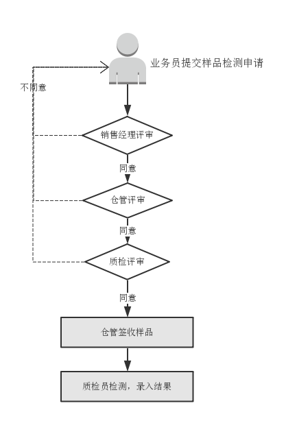
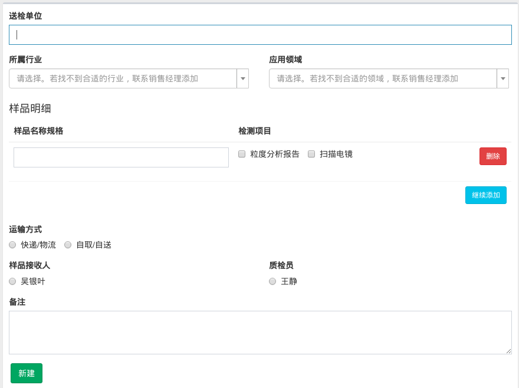

# 样品检测申请单

为了科学管理公司样品检测，有效支持销售的售前工作，提高部门间的工作效率，即日起对样品检测流程做如下规范：

## 提交检测申请单

样品检测遵循先评审、后检测的原则。当存在外来样品检测需求时，业务员首先填写申请单，申请单的内容大致如下：

提交后转入评审环节。

## 评审

评审的顺序为：销售经理 -> 仓管 -> 质检。评审的目的在于：

1. 参与其中的同事可以对自己所负责的工作环节进行审核，发现不合要求的内容后能及时反馈给业务员；
2. 各环节的同事人员可以提前做好准备工作；

## 签收

仓管
