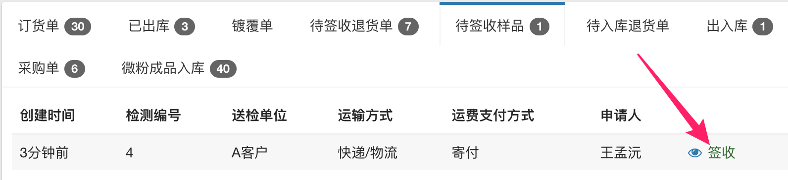
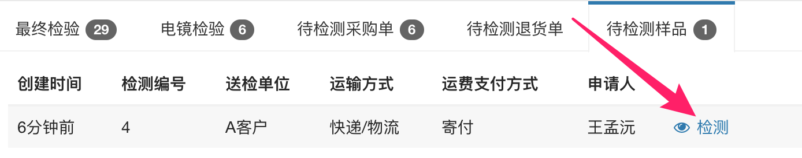
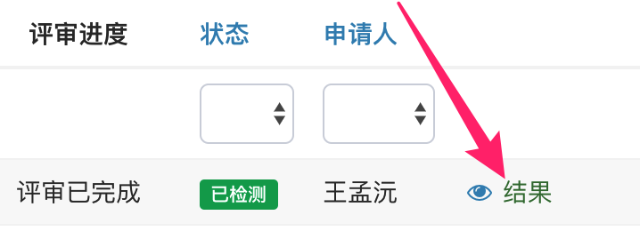

# 样品检测申请单

为了科学管理公司样品检测，有效支持业务员的售前工作，提高各部门的工作效率，现对样品检测流程做如下规范：

## 提交检测申请单

样品检测遵循先评审、后检测的原则。当样品检测需求产生时，业务员按照如下格式填写申请单：

提交后转入评审环节。

## 评审

评审过程在亚龙微助手内完成，评审的顺序为：销售经理 → 仓管 → 质检。评审的目的在于：

1. 相关同事可以对自己所负责的工作环节进行审核，发现不合要求的内容后能及时反馈给业务员；
2. 各环节的同事可以提前做好准备工作；

## 签收

仓管收到样品后，点击下图中的“签收”按钮：

## 检测

质检员点击下图中的“检测”按钮录入检测数据：

## 查看检测结果

业务员点击下图中的“结果”按钮可查看检测结果：

