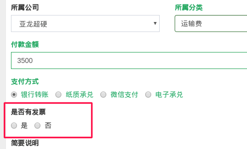
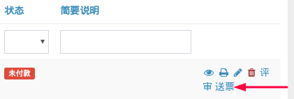
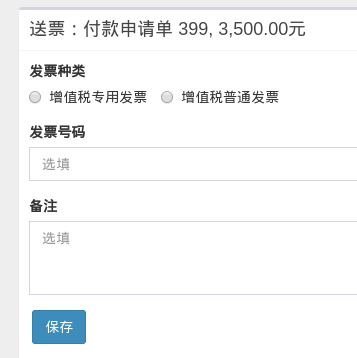
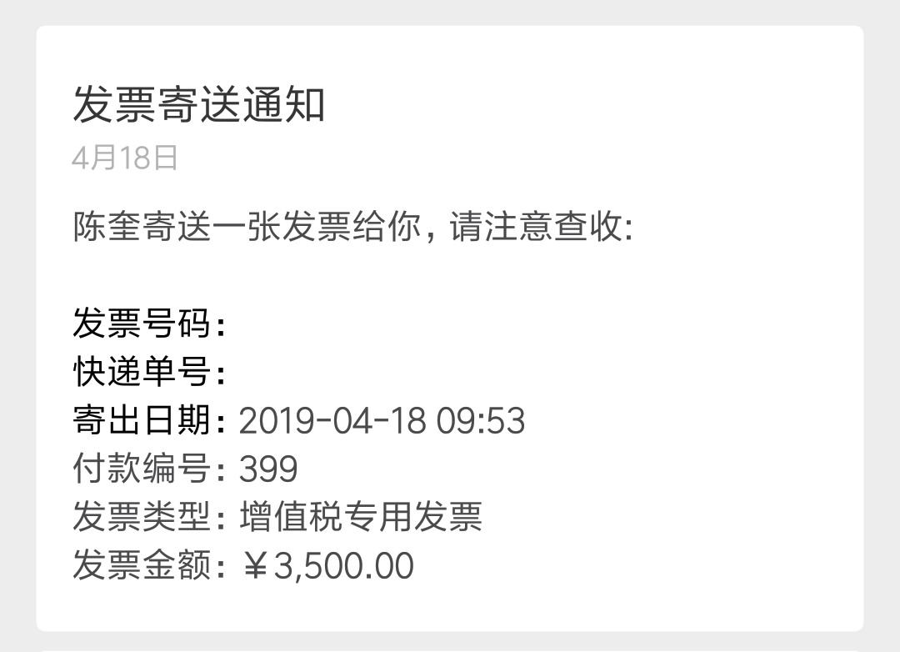
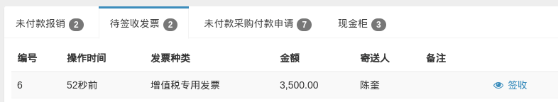
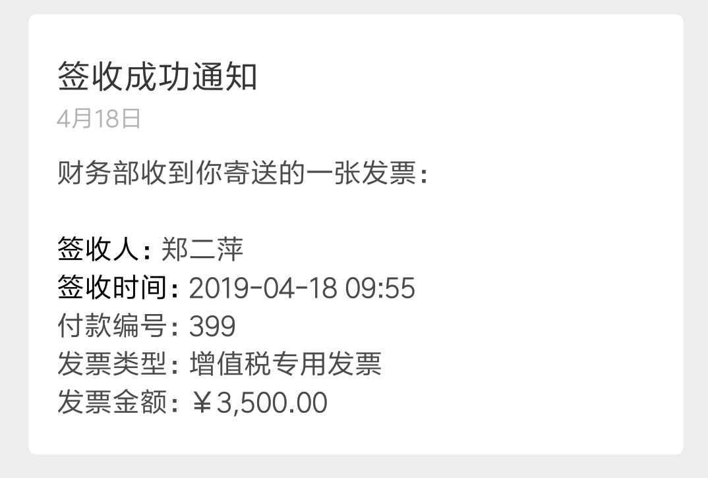

# 管理付款发票

付款申请中存在先付款、后取得发票的情况，为了让申请人和财务准确掌握发票的寄送、签收情况，系统于 2019-04-19 增加付款发票管理功能。

## 一、确认是否开票

付款申请页面增加“是否有发票”选项，员工在填写表单时正确选择是否开票。

## 二、送票

付款申请提交后，如果有发票，申请人在取得发票后点击“送票”操作：

表单提交后，亚龙微助手发送如下格式的发票寄送通知给出纳：

至此，系统内的送票操作完成。申请人将纸质发票交给出纳。

## 三、收票

出纳收到发票后，在订单系统首页找到对应的发票记录：

核对无误后，点击“签收”操作，完成签收。亚龙微助手同时给申请人发送如下格式的签收通知：

至此，付款申请人和出纳上方均确认发票已寄送且已收到。
