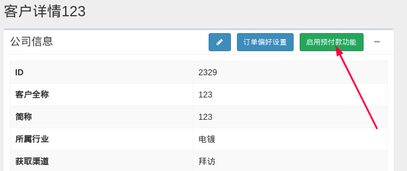
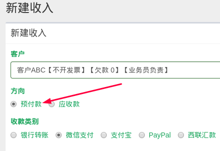

# 客户预付款账户

为了精确统计客户的往来账款，系统于 2019-04-10 增加客户预付款账户，与之前的应收账款账户加以区分。

## 开启及使用方法

预付款账户默认不开启，当客户存在预付款往来行为时，业务员需告知财务主管开启预付款账户。

在客户详情页面内，点击下图中绿色按钮开启预付款账户。

财务在新建收入页面，根据到款的类别，选择收入是计入预付款还是应收款。

业务员在后续订单付款页面可以自由选择预付款账户还是账户余额进行支付。

