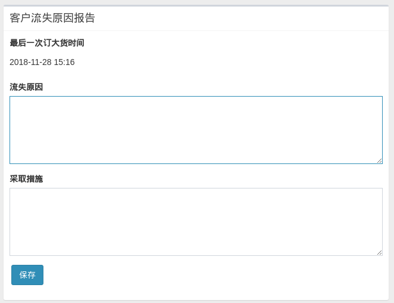

# 客户流失

为了更好地管理客户关系，系统新增客户流失监测功能。借助此功能，业务员能精确掌握客户的订货变化情况。

## 流失判定标准

超过 90 天未订货的 A, B 类客户视为流失客户。客户最后订货时间在客户详情页面内有显示：

说明：

1. 这里的订货指大货，不包括样品；
2. 大货订单发货后，系统才会刷新客户的最后订货时间，仅提交订单不刷新；

## 填写流失原因

重要客户流失后，系统会在业务员首页进行提醒：

业务员须在 7 日内填写流失原因：

逾期未填写将影响下单操作。
