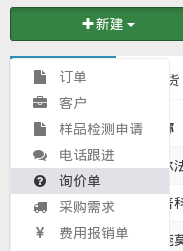
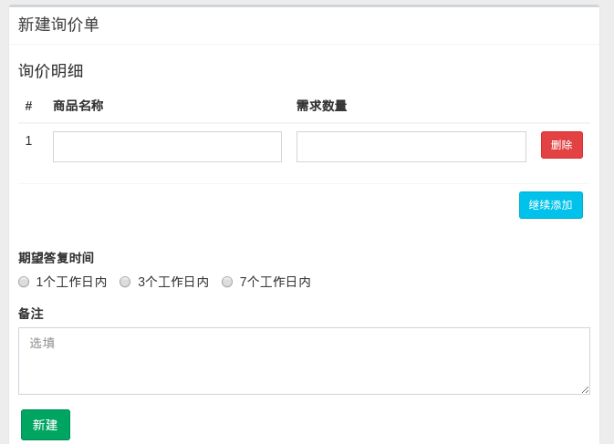
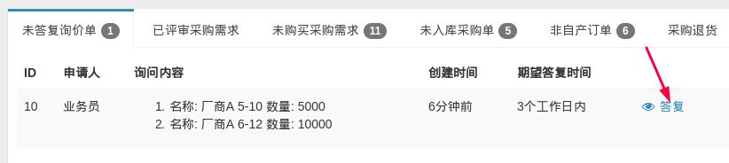
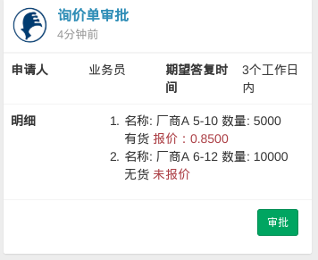
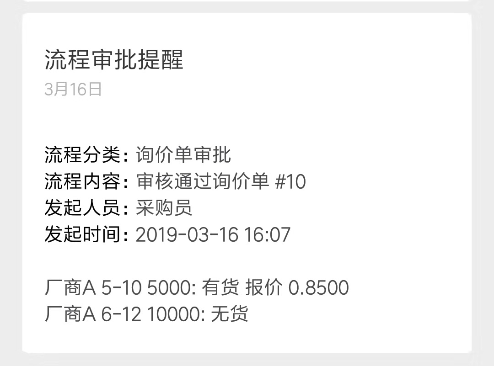
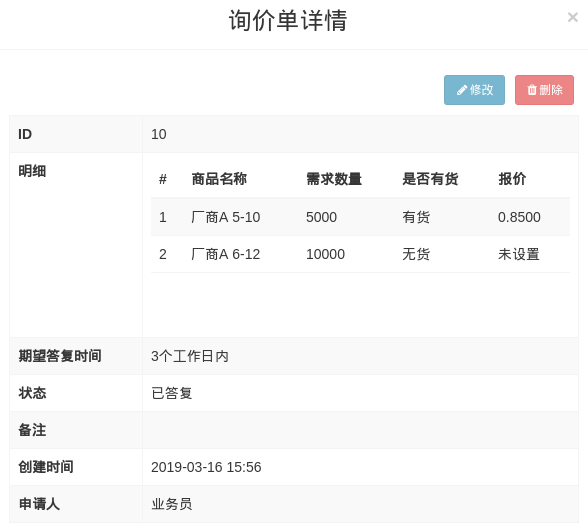

# 询价单

订单系统新增询价功能，方便业务员及时了解特殊商品的价格，为售前工作做准备。以下简单演示大致流程。

## 一 申请

在系统首页新建询价单：

根据需要填写表单：

表单提交后，交由采购员评审。

## 二 答复

采购员在首页对询价单进行一一答复。

## 三 复审（可选）

采购员可根据实际情况，转交总经理对报价进行复审。

评审结束后，业务员将在亚龙微助手内收到提醒：

业务员可在`采购→询价单`内查找自己的询价单。询价单的详情页面大致如下：

