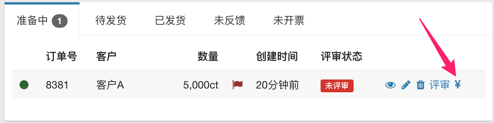
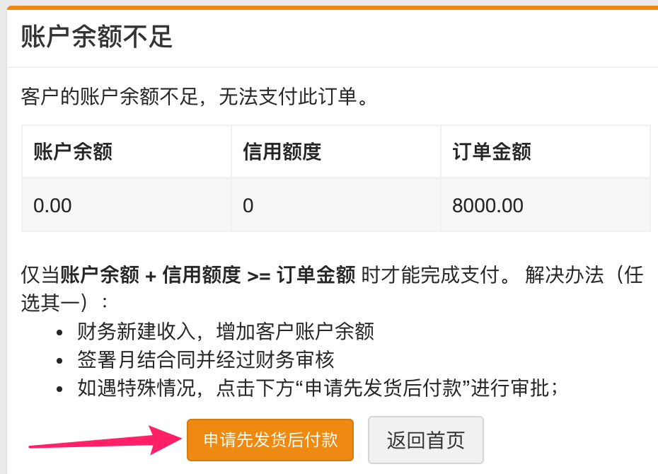
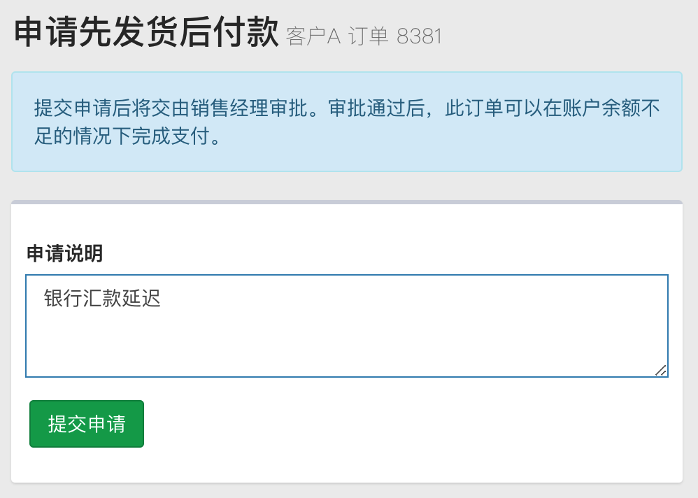
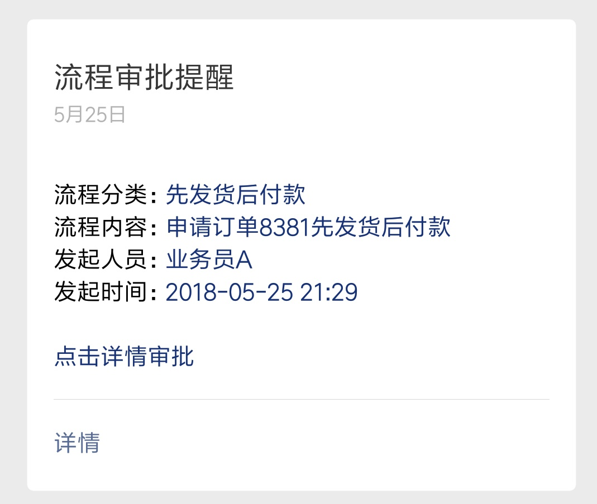
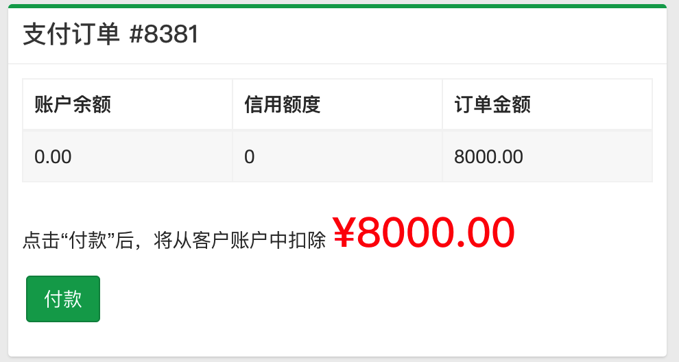

# 先发货后付款申请流程

目前仓库对单笔结算订单的出库规则是：只有状态为”已付款“（绿旗）的订单才能出库。在实际操作过程中存在一些特殊情况（如银行转账延迟等），导致订单无法及时发货。目前的做法是：业务员在分享逍客内提交一个审批，业务员将审批截图发给仓库，仓库据此发货。这种办法存在两个问题：

1. 订单的实际状态与系统中显示的状态不符。系统中显示某个订单还处于备货状态，但实际上货物已经出库发货；
2. 流程繁琐。业务员需要先在分享逍客上提交审批，通过后还要再电话通知仓库。

为了解决上述问题，现对这类审批流程进行改进。新的流程无需在纷享销客提交审批，结合亚龙微助手，让业务员能快速、高效地完成审批。下面用一个例子模拟整个流程，假设业务员 A 有一个名为”客户 A “的单笔结算客户。业务员 A 下单后，点击付款按钮：

由于这是一个单笔结算客户，客户的账户余额为 0, 此时无法完成付款，会看到如下提示：

点击图中”申请先发货后付款“按钮：

在申请说明栏中填写此次申请的原因，提交申请。之后销售经理将收到该申请的推送提醒：

销售经理审批后转给李经理审批，李经理终审后，业务员将收到审核结果：

此时业务员在订单系统中再次点击“支付“按钮，系统将允许付款：

付款后，订单状态变为”已付款“，仓库将可以进行出库发货操作。此时客户的欠款金额为 8000 元，财务收到货款后进行新建收入操作冲减客户欠款，客户的账户余额将再次变成 0.

## 小结

从上面的演示可以看出，在整个审批流程中，业务员无需额外的沟通，可以在短时间内完成对特殊情况的特殊处理。此流程目前处于试运行阶段，如果大家发现流程中存在漏洞或有更好的改进意见，欢迎反馈。
