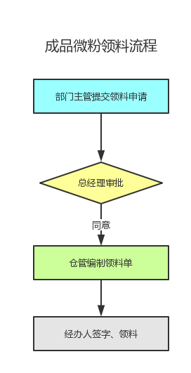
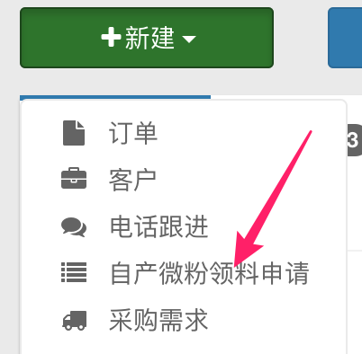
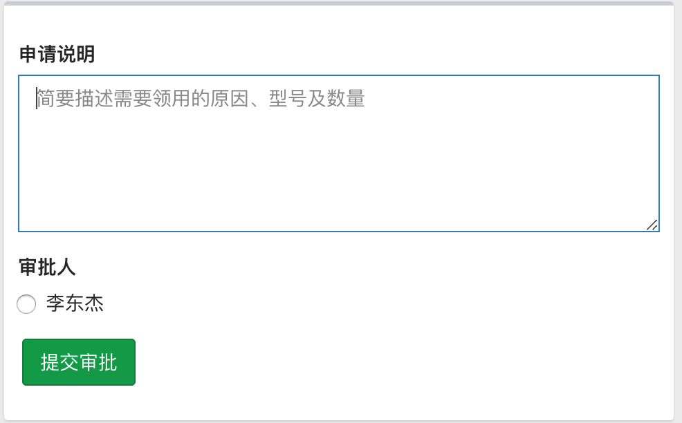
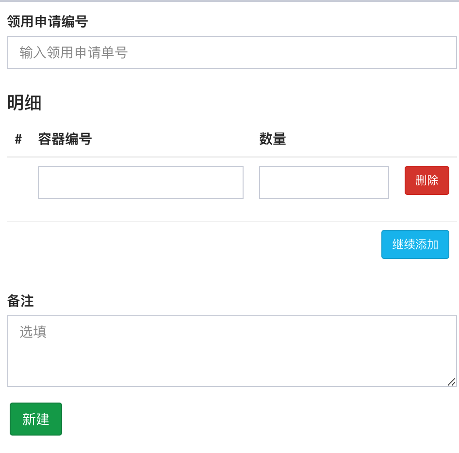

# 自产微粉领料流程

自产微粉出库操作以销售订单为主，还有一小部分跟销售订单无关，例如如下两种情况：

1. 给客户寄送数量较大的免费样品。
   
   目前销售订单提交免费样品有限额限制(至多 50 克拉)，因此只能以大货订单的形式体现。但由于实际并不存在资金，因此这种操作方式并不合理；

2. 给检测机构寄送小样； 
   
   目前的做法是在分享逍客内提交普通审批。这种做法的不足在于评审过程孤立，无法与仓库对接；

为改进上述流程，现对自产微粉领料流程做以下规范：

整个流程细分为以下四个步骤。

## 1 提交需求申请

销售经理或生产主管在系统首页点击“新建自产微粉领料申请”进入申请页面：

在申请说明中简要填写领料的粒度、数量及原因，并提交审批：

## 2 审批申请

总经理在“亚龙微助手”上完成审批操作，随后申请人和仓管会将同时收到微信提醒。

## 3 编制领料单

仓管根据领料申请编制正式的领料单：

## 4 签字、取料

仓库将货物准备好后通知经办人。经办人在物资收付卡上签字后，完成领料操作。
