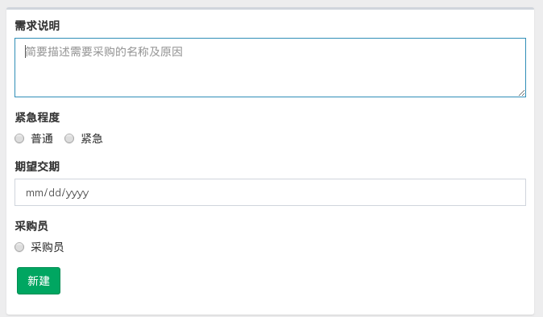
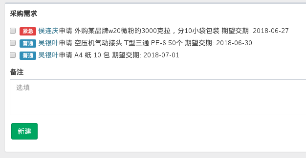
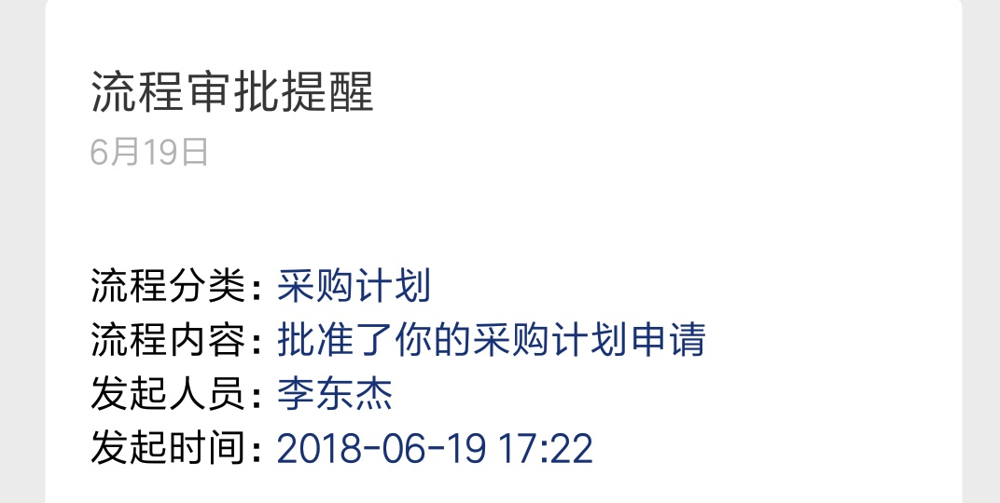
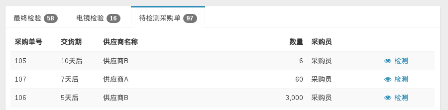
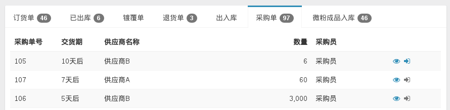

# 采购流程

按照最新质量认证及聂老师的要求，对公司采购流程进行如下规范。采购的物品主要包括三类：原材料及辅料、外购成品和低值易耗品。

> 注：此规范为试运行阶段，后期有可能调整。

## 操作流程

### 1. 员工新建采购需求申请

### 2. 根据采购需求制定采购计划

根据紧急程度和期望交期，采购员勾选采购需求，创建采购计划。并向总经理提交审批。

### 3. 总经理审批采购计划

总经理收到采购计划审批提醒后打开审批页面，根据实际情况勾选批准采购的计划并提交。

采购员随后将收到审批提醒，内容大致如下：

### 4. 根据采购计划制定采购单

采购员根据采购计划审批结果，编制正式的采购单。

### 5. 质检进行入库前检验

货物送达后，质检进行入库前检验，并将检验结果录入系统。

### 6. 仓管入库

仓管根据检测结果，将合格品存入仓库。

