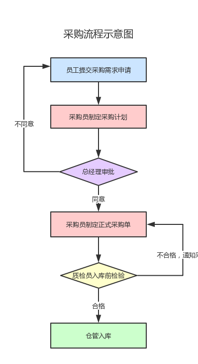
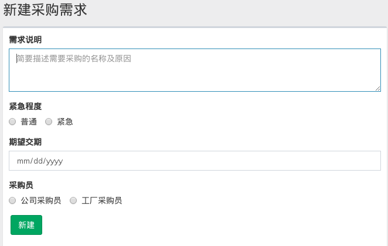
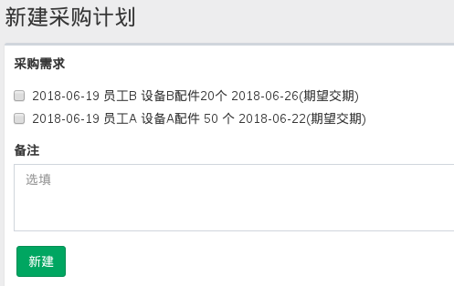
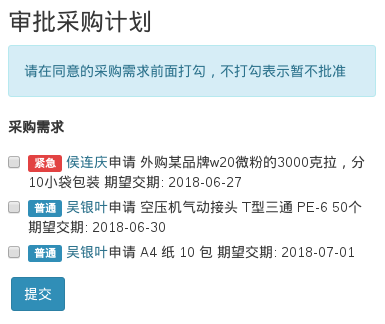
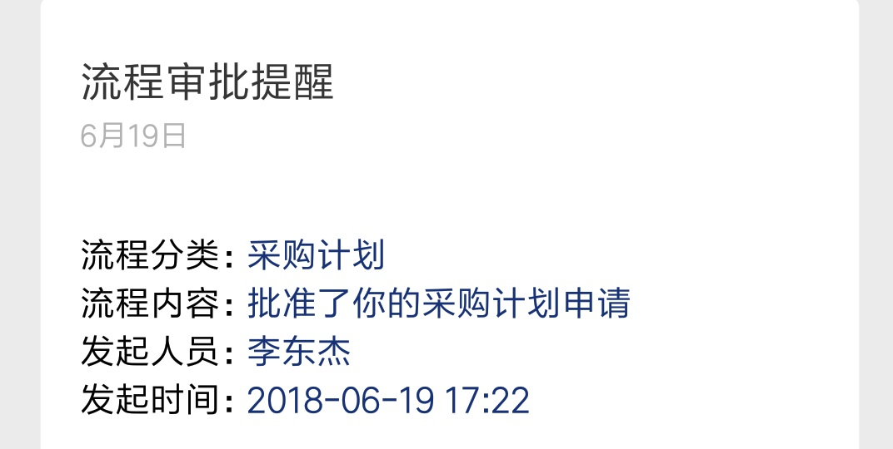

# 采购管理

按照最新质量认证及聂老师的要求，对公司采购流程进行如下规范：

> 注意：此规范为试运行阶段，随时可能变动。

## 操作流程

### 1. 员工新建采购需求

### 2. 采购员根据采购需求制定采购计划

### 3. 总经理审批采购计划

总经理收到采购计划审批提醒后打开审批页面，根据实际情况勾选批准采购的计划并提交。

采购员随后将收到审批提醒，内容大致如下：

### 4. 制定采购计划

采购员根据采购计划审批结果，编制正式的采购单。
