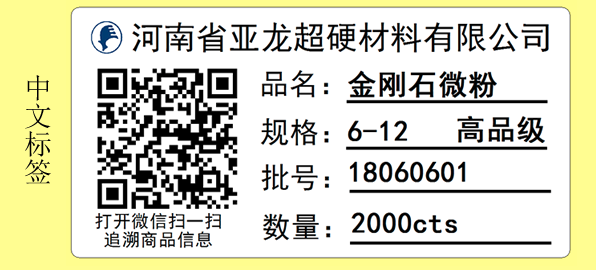
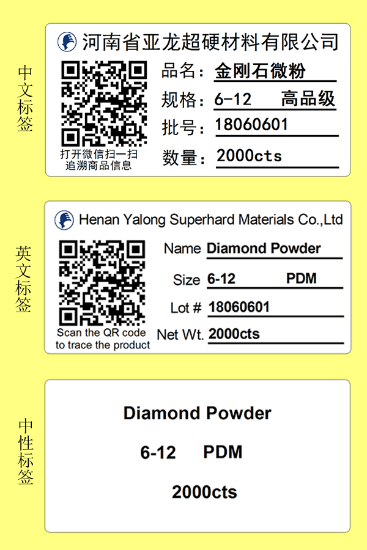
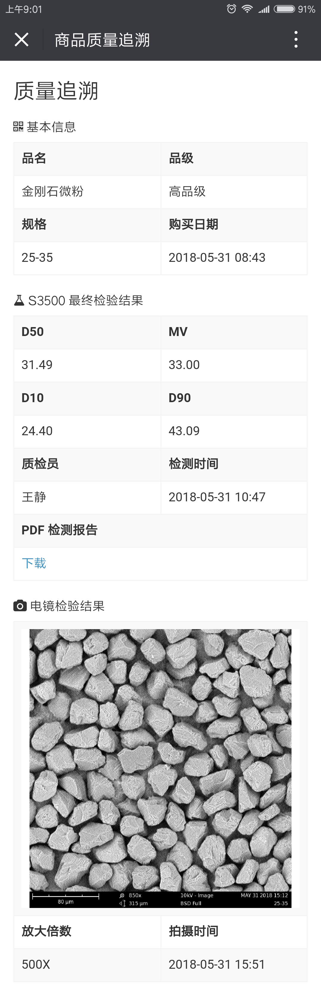

# 二维码标签简介

二维码标签与现有标签相比，有以下特点：

### 1. 自动打印减少出错

现有的标签由仓管逐一手工录入品名、规格、数量等信息，出错可能性较大；二维码标签直接从订单中自动导入对应的字段内容，仓管只需要输入打印的数量即可批量打印，有效降低了仓管的工作量，提高了工作效率。

### 2. 自带防伪功能

订单中的每一种货物都有一个唯一的二维码，二维码的内容在销售提交订单时自动生成，所有数据都存储在公司的服务器上，因此具有唯一性、无法伪造的特点，是天然的防伪标签。

### 3. 连接客户的新窗口

之前的标签展示内容单一，仅有规格和数量等基本信息。新标签上的二维码如同向客户打开了一个窗口，让客户借助微信，获取商品更多的信息。通过扫码，客户能看到商品从生产到发货之间所有环节的信息：何时过程检验，何时烘干入库、成品检测数据如何、质检员是谁、何时包装等等。客户通过扫码可以自行下载相关报告的电子版，方便客户使用，减少客服与客户间的沟通。

## 三种模板

二维码标签提供以下三种模板：

## 扫码页面展示

微信扫码后的页面效果如下：

## 标签替换时间

计划将在 2018 年 7 月 1 日全面使用二维码标签，这段时间大家有什么意见或建议，请反馈给我。
