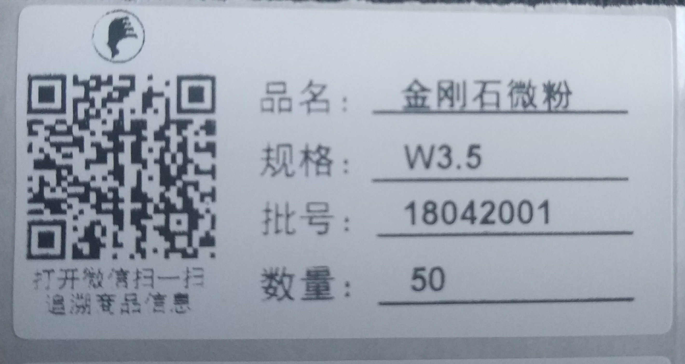

# 二维码标签简介

公司准备使用新型的二维码产品标签替换掉现有标签。与现有标签相比，新标签有如下特点：

### 1. 自动打印减少出错

当前的标签由仓管逐一手工录入品名、规格、数量等信息，工作内容机械重复，出错可能性较大；二维码标签直接从订单中自动导入对应的字段内容，仓管只需要输入打印的数量即可批量打印，有效降低了仓管的工作量，提高了工作效率。

### 2. 自带防伪功能

订单中的每一种货物都有一个唯一的二维码，二维码的内容在销售提交订单时自动生成，所有数据都存储在公司的服务器上，因此具有唯一性、无法伪造的特点，是天然的防伪标签。

### 3. 连接客户的新窗口

之前的标签展示内容单一，仅有规格和数量等基本信息。新标签上的二维码如同向客户打开了一个窗口，让客户借助微信，发现货物更多实用信息。通过扫码，客户能看到货物从生产到发货之间所有环节的信息：何时过程检验，何时烘干入库、成品检测数据如何、质检员是谁、何时包装等等。销售人员以后再也不必像传声筒那样，先向质检员索要粒度分析报告和电镜照片的电子版，再通过社交工具发送给客户，客户通过扫码可以随时下载相关报告的电子版，提升了客户的使用体验。

## 一个实例

开头的二维码标签是一个真实的例子，标签打印出来的效果如下：

微信扫码后的页面效果如下：

从中可以看到质检员使用 S3500 设备检测的结果。如果销售下单时在附件中勾选了“电镜照片”，待质检将电镜照片上传后，电镜照片将会直接显示在页面内。

## 意见反馈

请大家对标签的样式及扫码页面的内容多讨论多提意见，我来改进。最终的目的是为了让客户用着舒心、员工用着省心。
