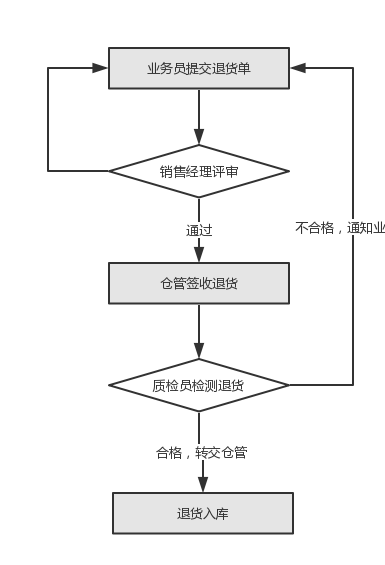

# 订单退货流程

为了更好地管理退货操作，现对订单的退货流程进行了调整，在现有基础上增加评审和检测两个环节。新的退货流程大致如下图所示：

## 1 评审

当退货发生时，业务员与客户沟通，确认退货的原因、型号和数量，填写退货申请单。退货单新建后，交由销售经理评审。通过评审的退货单将提醒到仓管。仓管收到退货后，对退货的外包装进行初步检查，确保无误后，签收包裹，并转交质检员检测。

## 2 检测

质检员对退货进行检测，新建退货检测单，将检测结果录入系统，并给出检测意见。对合格的退货，系统自动转交仓库进行入库操作；对不合格的退货，在亚龙微助手内通知业务员。

## 3 入库

仓管将检验合格的退货单进行入库操作。入库操作完成后，系统自动将退货金额返还至客户账户。
